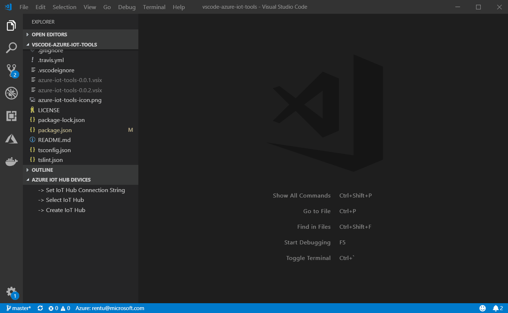
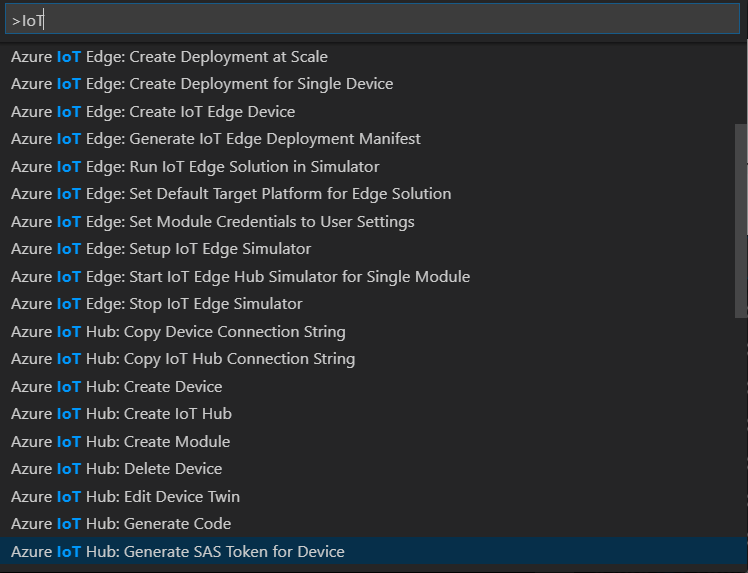

# Monitor D2C messages in VS Code

**Prerequisites**

1. If you don’t have an Azure subscription, create a [free account](https://azure.microsoft.com/free/?WT.mc\_id=A261C142F) before you begin.
2. Install [Visual Studio Code](https://code.visualstudio.com/)
3. Install the [Azure IoT Tools](https://marketplace.visualstudio.com/items?itemName=vsciot-vscode.azure-iot-tools) extension for Visual Studio Code

**Setup Azure IoT Hub through Sign in to Azure**

1. In Explorer of VS Code, click "Azure IoT Hub Devices" in the bottom left corner.
2. Click "Select IoT Hub" in context menu.
3. If you have not signed in to Azure, a pop-up will show to let you sign in to Azure.
4. After signing in, your Azure Subscription list will be shown, then select an Azure Subscription.
5. Your IoT Hub list will be shown, then select an IoT Hub.
6. The device list will be shown.

### Command Palette 

You can access almost all Azure IoT Services provided by these extensions through the Command Palette. Simply press F1, then type in **IoT** to find available commands.

**Monitor IoT Hub D2C message in Visual Studio Code**

While you could send message to your IoT Hub, it is also possible to monitor those messages in Visual Studio Code.

* Right-click your device and select **Start Monitoring Built-in Event Endpoint**.

.png>)

* The monitored messages will be shown in **OUTPUT > Azure IoT Hub** view.
* To stop monitoring, right-click the **OUTPUT** view and select **Stop Monitoring Built-in Event Endpoint**.

.png>)
