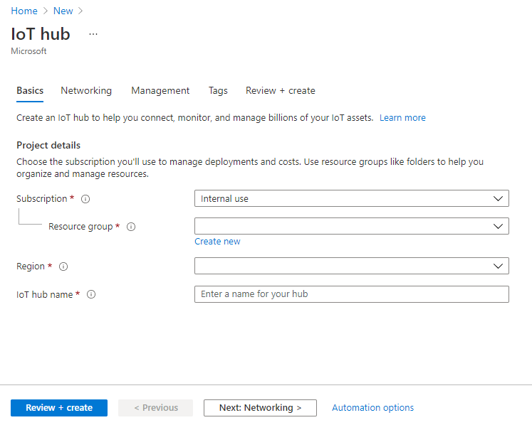

# Setup Azure IoT Hub

## Create an IoT hub 

This section describes how to create an IoT hub using the [Azure portal](https://portal.azure.com/).

1. Sign in to the [Azure portal](https://portal.azure.com/).
2. From the Azure homepage, select the **+ Create a resource** button, and then enter _IoT Hub_ in the **Search the Marketplace** field.
3. Select **IoT Hub** from the search results, and then select **Create**.
4.  On the **Basics** tab, complete the fields as follows:

    * **Subscription**: Select the subscription to use for your hub.
    * **Resource Group**: Select a resource group or create a new one. To create a new one, select **Create new** and fill in the name you want to use. To use an existing resource group, select that resource group. For more information, see [Manage Azure Resource Manager resource groups](https://docs.microsoft.com/en-us/azure/azure-resource-manager/management/manage-resource-groups-portal).
    * **Region**: Select the region in which you want your hub to be located. Select the location closest to you (e.g. UK West). Some features, such as [IoT Hub device streams](https://docs.microsoft.com/en-us/azure/iot-hub/iot-hub-device-streams-overview), are only available in specific regions. For these limited features, you must select one of the supported regions.
    * **IoT Hub Name**: Enter a name for your hub. This name must be globally unique.

    _Important : Because the IoT hub will be publicly discoverable as a DNS endpoint, be sure to avoid entering any sensitive or personally identifiable information when you name it._&#x20;

*   Select **Next: Networking** to continue creating your hub.

    Choose the endpoints that can connect to your IoT Hub. You can select the default setting **Public endpoint (all networks)**, or choose **Public endpoint (selected IP ranges)**, or **Private endpoint**. Accept the default setting for this example.
*   Select **Next: Management** to continue creating your hub.

    You can accept the default settings here. If desired, you can modify any of the following fields:

    *   **Pricing and scale tier**: Your selected tier. You can choose from several tiers, depending on how many features you want and how many messages you send through your solution per day. The free tier is intended for testing and evaluation. It allows 500 devices to be connected to the hub and up to 8,000 messages per day. Each Azure subscription can create one IoT hub in the free tier.

        If you are working through a Quickstart for IoT Hub device streams, _select the free tier._
    * **IoT Hub units**: The number of messages allowed per unit per day depends on your hub's pricing tier. For example, if you want the hub to support ingress of 700,000 messages, you choose two S1 tier units. For details about the other tier options, see [Choosing the right IoT Hub tier](https://docs.microsoft.com/en-us/azure/iot-hub/iot-hub-scaling).
    * **Defender for IoT**: Turn this on to add an extra layer of threat protection to IoT and your devices. This option is not available for hubs in the free tier. For more information about this feature, see [Azure Security Center for IoT](https://docs.microsoft.com/en-us/azure/asc-for-iot/).
    * **Advanced Settings** > **Device-to-cloud partitions**: This property relates the device-to-cloud messages to the number of simultaneous readers of the messages. Most hubs need only four partitions.
*   Select **Next: Tags** to continue to the next screen.

    Tags are name/value pairs. You can assign the same tag to multiple resources and resource groups to categorize resources and consolidate billing. For more information, see [Use tags to organize your Azure resources](https://docs.microsoft.com/en-us/azure/azure-resource-manager/management/tag-resources).
* Select **Next: Review + create** to review your choices. You see something similar to this screen, but with the values you selected when creating the hub.
* Select **Create** to create your new hub. Creating the hub takes a few minutes.

## Register a device 

* In the [Azure portal](https://portal.azure.com/), open your IoT hub.
* Click **Device Explorer**.
*   In the Device Explorer pane, click **Add** to add a device to your IoT hub.

    **Device ID**: The ID of the new device. Device IDs are case sensitive.

    **Authentication Type**: Select **Symmetric Key**.

    **Auto Generate Keys**: Check this field.

    **Connect device to IoT Hub**: Click **Enable**.

* Click **Save**.
* After the device is created, open the device in the **Device Explorer** pane.
* Make a note of the primary key of the connection string.

* Make a note of the device connection string, which looks like:
*   `HostName={YourIoTHubName}.azure-devices.net;DeviceId=MyPythonDevice;SharedAccessKey={YourSharedAccessKey}`

    You'll use this value later in the quickstart.

