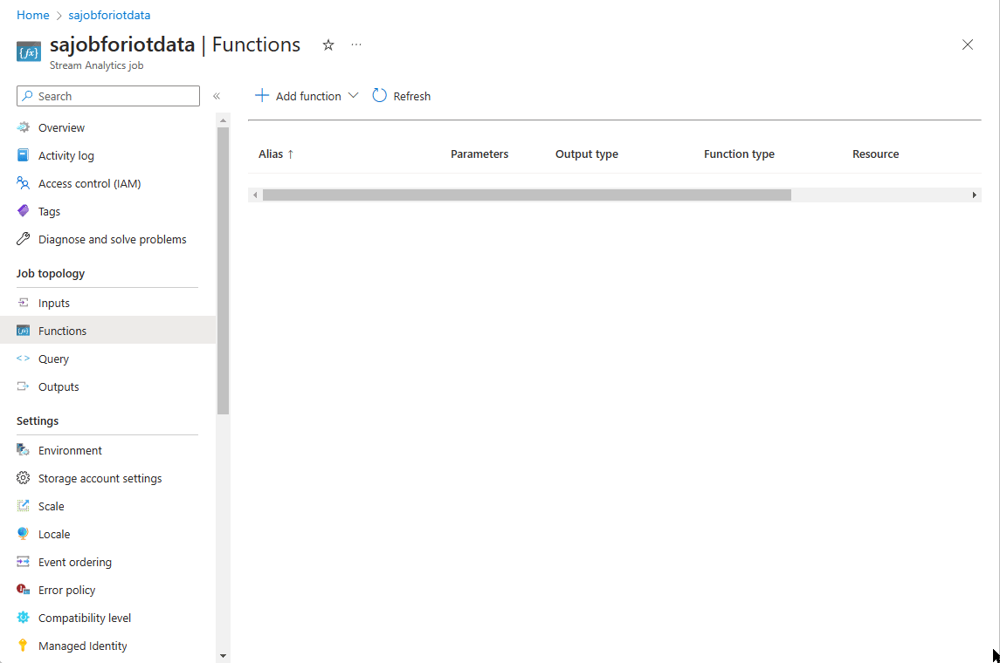
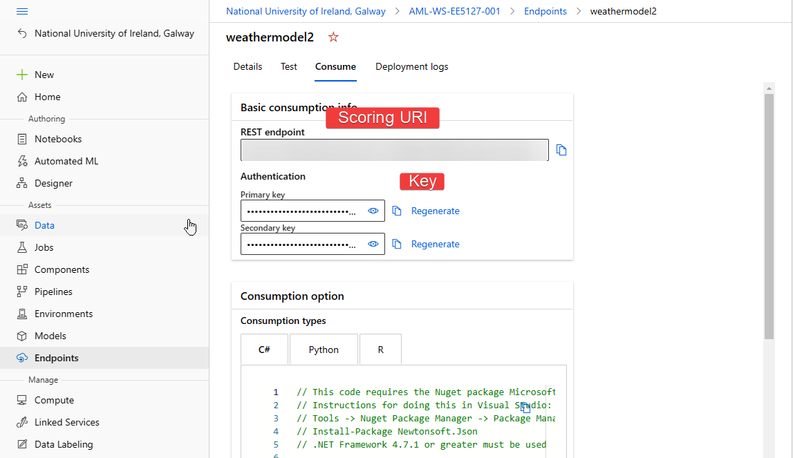

# Integrate ML Model with IoT Hub

### Add a machine learning model to stream analytics job <a href="#add-a-machine-learning-model-to-your-job" id="add-a-machine-learning-model-to-your-job"></a>

You can add Azure Machine Learning functions to your Stream Analytics job directly from the Azure portal

#### Azure portal <a href="#azure-portal" id="azure-portal"></a>

1. Navigate to your Stream Analytics job in the Azure portal, and select **Functions** under **Job topology**. Then, select **Azure Machine Learning Service** from the **+ Add** dropdown menu.
2. Fill in the **Azure Machine Learning Service function** form.
3.

    <figure><figcaption></figcaption></figure>
4. Enter "Function Alias" and select "Provide Azure ML Service settings manually".
5. Get the value of the Scoring URL and Key from the Endpoint created in the ML workspace and enter in the Soring URI and Key field. This is available under Endpoints -> Consume in ML Workspace.
6.

    <figure><figcaption></figcaption></figure>
7. Once the Scoring URI and Key are entered, the function signature automatically loads. If your function signature fails to load, there could be a problem with the creation of the Endpoint in the ML workspace. Revisit the Endpoint creation process and ensure that Endpoint is working by using the Test option in Endpoints.

### Calling machine learning endpoint from your query <a href="#calling-machine-learning-endpoint-from-your-query" id="calling-machine-learning-endpoint-from-your-query"></a>

When your Stream Analytics query invokes an Azure Machine Learning UDF, the job creates a JSON serialized request to the web service. The request is based on a model-specific schema that Stream Analytics infers from the endpoint's swagger.

The following Stream Analytics query is an example of how to invoke an Azure Machine Learning UDF:

```
SELECT udf.score(<model-specific-data-structure>)
INTO output
FROM input
WHERE <model-specific-data-structure> is not null
```

A more specific query is given below. This is an example from a weather prediction model where the machine learning service (function) takes three parameters i.e. isRain, temperature, humidity and returns predictions.

```
WITH Ip AS
(
SELECT 
    "isRain",
    "temperature",
    "humidity"
FROM
[iothubinput]
)
SELECT udf.weathermodel(Ip)
INTO
    [iothubbloboutput]
FROM
    Ip
```

If your input data sent to the ML UDF is inconsistent with the expected schema, the endpoint will return a response with error code 400, which will cause your Stream Analytics job to go to a failed state. [Demo video from Microsoft](https://www.microsoft.com/en-us/videoplayer/embed/RE4RMir?postJsllMsg=true).
