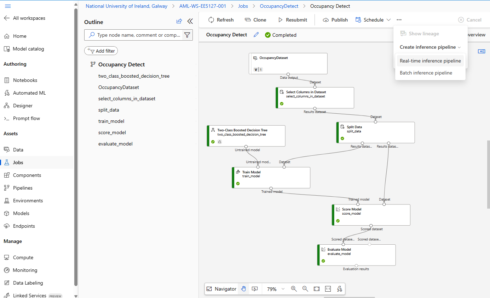

# BLE Connectivity

### Feather nRF52840 as BLE Peripheral Device

Use the following CircuitPython code to make your board act as a peripheral device. The code will advertise the name of the device and services that are available on your board.

You may need to install the `adafruit_ble` library. The process of installing the BLE library is the same as the [sensor libraries installed](sensor-data-acquisition/install-libraries.md) for Sensor Data Acquisition.&#x20;

Copy the following code to the `code.py` in `CIRCUITPY` drive.

````python
```python
# Provide a remote sensing service over Bluetooth Low-Energy (BLE).
# ----------------------------------------------------------------
# Import the standard Python time functions.
import time
import digitalio
import board

# Import the Adafruit Bluetooth library.  Technical reference:
# https://circuitpython.readthedocs.io/projects/ble/en/latest/api.html
from adafruit_ble import BLERadio
from adafruit_ble.advertising.standard import ProvideServicesAdvertisement
from adafruit_ble.services.nordic import UARTService

# ----------------------------------------------------------------
# Initialize global variables for the main loop.
ledpin= digitalio.DigitalInOut(board.BLUE_LED)
ledpin.direction = digitalio.Direction.OUTPUT

ble = BLERadio()
ble.name = "MyStudentID:XXXXX"
uart = UARTService()
advertisement = ProvideServicesAdvertisement(uart)

# Flags for detecting state changes.
advertised = False
connected  = False

# The sensor sampling rate is precisely regulated using the following timer variables.
sampling_timer    = 0.0
last_time         = time.monotonic()
sampling_interval = 0.10

# ----------------------------------------------------------------
# Begin the main processing loop.

while True:

    # Read the accelerometer at regular intervals.  Measure elapsed time and
    # wait until the update timer has elapsed.
    now = time.monotonic()
    interval = now - last_time
    last_time = now
    sampling_timer -= interval
    if sampling_timer < 0.0:
        sampling_timer += sampling_interval
        x, y, z = (10,20,30)
    else:
        x = None

    if not advertised:
        ble.start_advertising(advertisement)
        print("Waiting for connection.")
        advertised = True

    if not connected and ble.connected:
        print("Connection received.")
        connected = True
        ledpin.value = True
        
    if connected:
        if not ble.connected:
            print("Connection lost.")
            connected = False
            advertised = False
            ledpin.value = False            
        else:
            if x is not None:
                uart.write(b"%.3f,%.3f,%.3f\n" % (x, y, z))
```
````

### Smart Phone as Central Device

To interact with your board (peripheral device) from your phone or tablet, you'll use the Adafruit [Bluefruit LE Connect App](https://learn.adafruit.com/bluefruit-le-connect-for-ios). Install it from the [Apple App Store](https://itunes.apple.com/us/app/adafruit-bluefruit-le-connect/id830125974) or [Google Play App Store](https://play.google.com/store/apps/details?id=com.adafruit.bluefruit.le.connect).

Start your Adafruit Feather nRF52840 board with code running from **code.py**. You must have the Bluetooth connectivity code running for this to work.

Next, start up the Bluefruit LE Connect app, and make sure it's in Central Mode (left button on the bottom).  When you start the app, you should see the name of your device. If there's a long list of devices, you can shorten it by turning on the "**Must have UART Service**" switch.

To connect to the Adafruit Feather nRF52840, touch the **Connect** button. You should see "**Connecting**" and then "**Discovering Services**".

If you don't see your device right away, try pulling down to refresh. If that doesn't work, try turning Bluetooth off and back on on your phone or tablet and restarting the app.

<figure><figcaption></figcaption></figure>

#### Device Menu

After you connect, you'll see a menu of how you can interact with the device. Choose **UART**.

<figure><figcaption></figcaption></figure>

Data sent from the peripheral BLE device will appear in red.

<figure><figcaption></figcaption></figure>

### More BLE experiments

* [Button Press](https://learn.adafruit.com/circuitpython-nrf52840/button-press)
* [NeoPixel Color](https://learn.adafruit.com/circuitpython-nrf52840/neopixel-color)
* [Mobile Movement Data](https://learn.adafruit.com/circuitpython-nrf52840/mobile-movement-data)
* [Location](https://learn.adafruit.com/circuitpython-nrf52840/location)
