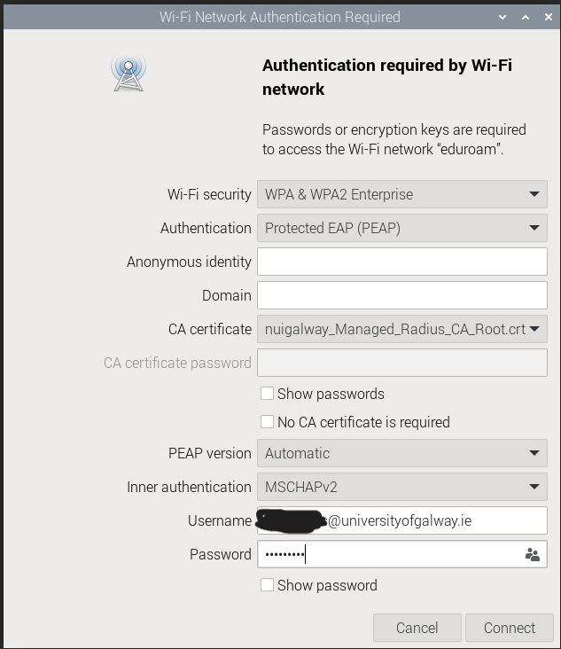

# Raspberry Pi

### Connecting to eduroam

Connecting to eduroam network requires a CA certificate, which can be downloaded from [University of Galway eudoram](https://www.universityofgalway.ie/information-solutions-services/servicesforstaff/wifi/eduroam/). The download link should be available under `Manual Configuration` tab.

Next, select `eduroam` from the list of available Wireless network connections on Raspberry Pi and enter configuration details as shown in the following screenshot. Choose the downloaded certificate in `CA certificate` field below.

<figure><figcaption></figcaption></figure>

Select `Connect` once all details have been correctly entered and you should be able to connect to `eduroam` network.
