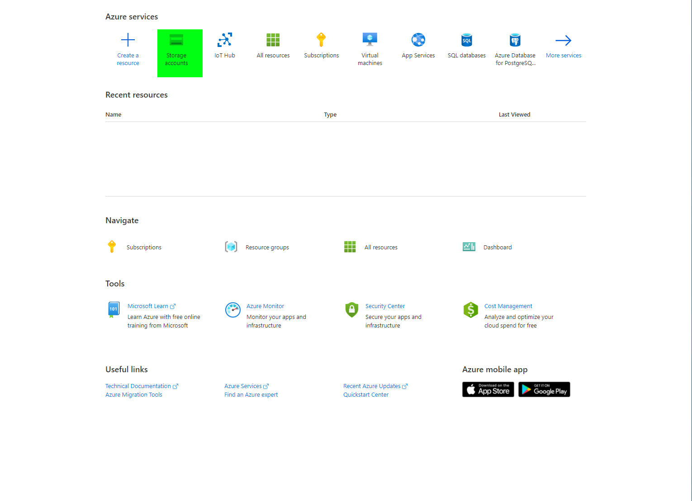

# Save telemetry data to Azure Blob storage

### In this article

This quickstart shows you how to use a Stream Analytics job to read data from the IoT hub, and write the data to a container in Azure blob storage. The input data used in this article is generated by a Raspberry Pi online simulator. You can define a Stream Analytics job that not only stores reads  and stores real-time streaming data but can also transform the data (e.g. filtering messages with a temperature greater than 27).&#x20;

## Before you begin <a href="#before-you-begin" id="before-you-begin"></a>

* If you don't have an Azure subscription, create a [free account](https://azure.microsoft.com/free/).
* Sign in to the [Azure portal](https://portal.azure.com/).

Before defining the Stream Analytics job, you should prepare the input data. The real-time sensor data is ingested to IoT Hub, which later configured as the job input. To prepare the input data required by the job, complete the following steps:

## Create blob storage <a href="#create-blob-storage" id="create-blob-storage"></a>

1. From the upper left-hand corner of the Azure portal, select **Create a resource** > **Storage** > **Storage account**.
2. In the **Create storage account** pane, enter a storage account name, location, and resource group. Choose the same location and resource group as the IoT Hub you created. Then click **Review + create** to create the account.
3. Once your storage account is created, select the **Containers** tile on the **Overview** pane.
4. From the **Containers** page, Add **Container** and provide a name for your container, such as _iothubdatacontainer_. Leave the **Public access level** as **Private (no anonymous access)** and select **OK**.




## Create a Stream Analytics job <a href="#create-a-stream-analytics-job" id="create-a-stream-analytics-job"></a>

1. Sign in to the Azure portal.
2. Select **Create a resource** in the upper left-hand corner of the Azure portal.
3. Select **Internet of Things** > **Stream Analytics job** from the results list (you may have to click See all to find Stream Analytics job or use search the Marketplace search bar).
4.  Fill out the Stream Analytics job page with the following information:

    | **Setting**         | **Suggested value**      | **Description**                                                                                                                                                                                                                                                                                                                        |
    | ------------------- | ------------------------ | -------------------------------------------------------------------------------------------------------------------------------------------------------------------------------------------------------------------------------------------------------------------------------------------------------------------------------------- |
    | Job name            | ee5122iothubstorageSAjob | Enter a name to identify your Stream Analytics job. Stream Analytics job name can contain alphanumeric characters, hyphens, and underscores only and it must be between 3 and 63 characters long.                                                                                                                                      |
    | Subscription        |                          | Select the Azure subscription that you want to use for this job.                                                                                                                                                                                                                                                                       |
    | Resource group      | EE5122                   | Select the same resource group as your IoT Hub.                                                                                                                                                                                                                                                                                        |
    | Location            | UK West                  | Select geographic location where you can host your Stream Analytics job. Use the location that's closest to your users for better performance and to reduce the data transfer cost.                                                                                                                                                    |
    | Streaming units     | 1                        | Streaming units represent the computing resources that are required to execute a job. By default, this value is set to 1. To learn about scaling streaming units, refer to [understanding and adjusting streaming units](https://docs.microsoft.com/en-us/azure/stream-analytics/stream-analytics-streaming-unit-consumption) article. |
    | Hosting environment | Cloud                    | Stream Analytics jobs can be deployed to cloud or edge. Cloud allows you to deploy to Azure Cloud, and Edge allows you to deploy to an IoT Edge device.                                                                                                                                                                                |
5. Select **Create** and you should see a _Deployment in progress..._ notification displayed in the top right of your browser window.
6. Check the **Pin to dashboard** box to place your job on your dashboard when the option is available.

## Configure job input <a href="#configure-job-input" id="configure-job-input"></a>

In this section, you will configure an IoT Hub device input to the Stream Analytics job. Use the IoT Hub you created in the previous section of the quickstart.

1. Navigate to your Stream Analytics job.
2. Select **Inputs** > **Add Stream input** > **IoT Hub**.
3.  Fill out the **IoT Hub** page with the following values:

    | **Setting**  | **Suggested value**  | **Description**                                                                                                                                                                                                                     |
    | ------------ | -------------------- | ----------------------------------------------------------------------------------------------------------------------------------------------------------------------------------------------------------------------------------- |
    | Input alias  | IoTHubInput          | Enter a name to identify the job’s input.                                                                                                                                                                                           |
    | Subscription |                      | Select the Azure subscription that has the storage account you created. The storage account can be in the same or in a different subscription. This example assumes that you have created storage account in the same subscription. |
    | IoT Hub      | ee5122-sendtelemetry | Enter the name of the IoT Hub you created in the previous section.                                                                                                                                                                  |
4. Leave other options to default values and select **Save** to save the settings.

## Configure job output <a href="#configure-job-output" id="configure-job-output"></a>

1. Navigate to the Stream Analytics job that you created earlier.
2. Select **Outputs** > **Add** > **Blob storage**.
3.  Fill out the **Blob storage** page with the following values:

    | **Setting**                | **Suggested value** | **Description**                                                                                                                                                                                                                     |
    | -------------------------- | ------------------- | ----------------------------------------------------------------------------------------------------------------------------------------------------------------------------------------------------------------------------------- |
    | Output alias               | IoTHubBlobOutput    | Enter a name to identify the job’s output.                                                                                                                                                                                          |
    | Subscription               |                     | Select the Azure subscription that has the storage account you created. The storage account can be in the same or in a different subscription. This example assumes that you have created storage account in the same subscription. |
    | Storage account            | ee5122iothubstorage | Choose or enter the name of the storage account. Storage account names are automatically detected if they are created in the same subscription.                                                                                     |
    | Container                  | iothubdatacontainer | Select the existing container that you created in your storage account.                                                                                                                                                             |
    | Authentication mode        | Connection string   | Select Connection string option and Storage account key will be automatically filled                                                                                                                                                |
    | Event serialization format | JSON                |                                                                                                                                                                                                                                     |
4. Leave other options to default values and select **Save** to save the settings.

## Define the transformation query <a href="#define-the-transformation-query" id="define-the-transformation-query"></a>

1. Navigate to the Stream Analytics job that you created earlier.
2.  Select **Query** and edit the query as follows:

    ```
    SELECT *
    INTO IoTHubBlobOutput
    FROM IoTHubInput
    ```
3. In this example, the query reads the data from IoT Hub and copies it to a new file in the blob. Select **Save Query**.
4. Click **Test Query and** it will send sample data to the IoT Hub and display the sample data.


## Run the IoT simulator <a href="#run-the-iot-simulator" id="run-the-iot-simulator"></a>

1. Open the [Raspberry Pi Azure IoT Online Simulator](https://azure-samples.github.io/raspberry-pi-web-simulator/).
2. Replace the placeholder in Line 15 with the Azure IoT Hub device connection string you saved in a previous section.
3. Click **Run**. The output should show the sensor data and messages that are being sent to your IoT Hub.

## Start the Stream Analytics job and check the output <a href="#start-the-stream-analytics-job-and-check-the-output" id="start-the-stream-analytics-job-and-check-the-output"></a>

1. Return to the job overview page and select **Start**.
2. Under **Start job**, select **Now**, for the **Job output start time** field. Then, select **Start** to start your job. Wait until Stream analytics job started notification appears after a few minutes.
3. Open the [Raspberry Pi Azure IoT Online Simulator](https://azure-samples.github.io/raspberry-pi-web-simulator/).
4. Replace the placeholder in Line 15 with the Azure IoT Hub device connection string you saved in a previous section.
5. Click **Run**. The output should show the sensor data and messages that are being sent to your IoT Hub.
6. After few minutes, in the portal, find the storage account (_ee5122iothubstorage_) & the container that you have configured as output for the job (_iothubdatacontainer_). You can now see the output file in the container. The job takes a few minutes to start for the first time, after it is started, it will continue to run as the data arrives.


## Clean up resources <a href="#clean-up-resources" id="clean-up-resources"></a>

When no longer needed, delete the resource group, the Stream Analytics job, and all related resources. Deleting the job avoids billing the streaming units consumed by the job.

